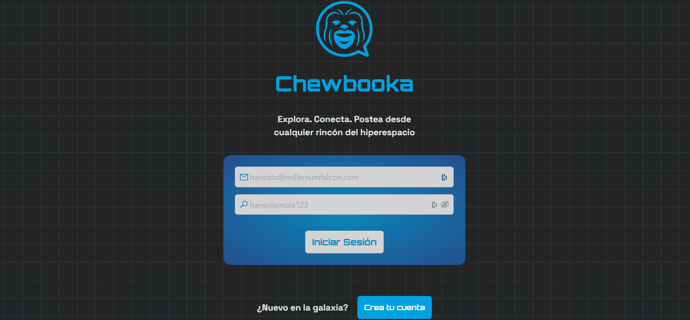
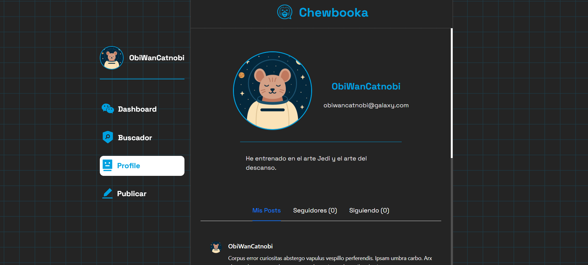
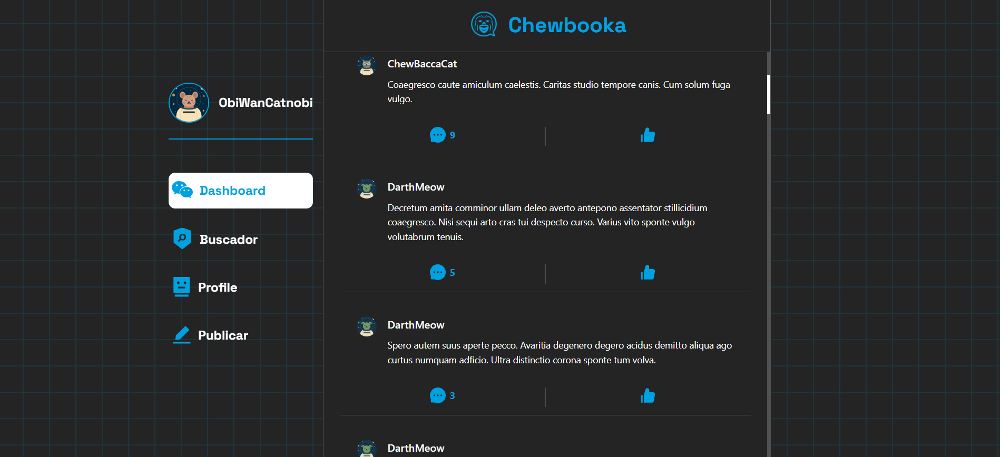

# 🌌🪐 Chewbooka 

>Chewbooka — la red social donde jedis, contrabandistas, droide, y rebeldes se reúnen para compartir sus aventuras y secretos por toda la galaxia. Desde Tatooine hasta Coruscant, conecta con pilotos de cazas estelares, maestros de la Fuerza y héroes de la Alianza Rebelde.

>Postea tus batallas épicas, teorías sobre los Sith o tus últimas misiones, y conversa con aliados o rivales en tiempo real. Con tecnología de punta del hiperespacio —React y Redux—, Chewbooka te ofrece una experiencia tan rápida como el salto a la velocidad de la luz.

>Que la Fuerza te acompañe mientras exploras, conectas y dejas tu huella en esta galaxia social.

---

## 🖼️ Vista previa





---

## 🚀 Tecnologías utilizadas

- ⚛️ React 19
- 🧠 Redux Toolkit
- 🔀 React Router DOM v7
- 🎨 Ant Design v5
- 🔧 Axios
- 🗃️ Redux 
- 💥ReactBits 

---

## 📁 Estructura del proyecto
```plaintext
├── app/
│   └── store.js
├── assets/
│   ├── fonts/
│   └── logo.png
├── blocks/
│   └── (implementación de ReactBits)
├── components/
│   ├── auth/
│   ├── comments/
│   ├── common/ (button, footer, header, etc.)
│   ├── home/
│   ├── posts/
│   │   ├── AddPostForm/
│   │   ├── Comment/
│   │   ├── Post/
│   │   ├── PostCard/
│   │   ├── PostDetail/
│   │   └── Posts/
│   └── users/
│       └── Profile/ (tabs, info, usercard)
├── features/
│   ├── auth/
│   ├── comments/
│   ├── posts/
│   └── users/
├── hooks/
│   └── useWindowWidth.js
├── App.jsx
├── App.css
├── index.css
└── main.jsx
```
## ⚙️ Instalación y ejecución local

```bash
# 1. Clonar el repositorio
git clone https://github.com/alejandrogoscu/chewbooka.git
cd chewbooka

# 2. Instalar dependencias
npm install

# 3. Ejecutar el proyecto (modo desarrollo)
npm run dev
```
>⚠️ Este proyecto requiere un backend para funcionar correctamente. Las variables de entorno necesarias están configuradas solo en el backend.

## 🌟 Funcionalidades principales

- ✅ Registro e inicio de sesión de usuarios  
- 📝 Creación de publicaciones  
- 💬 Comentarios en tiempo real  
- 👤 Perfiles de usuario con pestañas  
- 🔍 Buscador de publicaciones  
- 📱 Diseño responsive  

---

## 🛡️ Sistema de Guards

Para proteger rutas sensibles y asegurar que solo usuarios autenticados puedan acceder a ciertas páginas, se ha implementado un sistema de Guards basado en React Router y Redux.

- Las rutas protegidas verifican el estado de autenticación global (almacenado en Redux).  
- Si el usuario no está autenticado, es redirigido automáticamente a la página de login.  

Esto garantiza seguridad y mejor experiencia de usuario evitando accesos no autorizados.

---

## 🙌 Contribuciones

¡Contribuciones galácticas son bienvenidas!

Si quieres colaborar, por favor sigue estos pasos:

1. Haz un fork del repositorio  
2. Crea una nueva rama:  
   ```bash
   git checkout -b feature/nueva-feature
   ```
3. Haz tus cambios y haz commit
    ```bash
    git commit -m "Agrega nueva feature"
   ```
4. Push a tu rama:
    ```bash
    git push origin feature/nueva-feature
   ```
5. Crea un Pull Request

## ✨ Agradecimientos

- A la comunidad de Star Wars por inspirar esta galaxia virtual 🛸  
- A React y Redux por hacerlo posible  
- Al equipo de PatitasConectadas 🐾
- A la Fuerza 🧘

## 📄 Licencia

Este proyecto está bajo la Licencia MIT.

---

## 🔗 Enlaces útiles

- [React](https://reactjs.org/)  
- [Redux Toolkit](https://redux-toolkit.js.org/)  
- [Ant Design](https://ant.design/)  